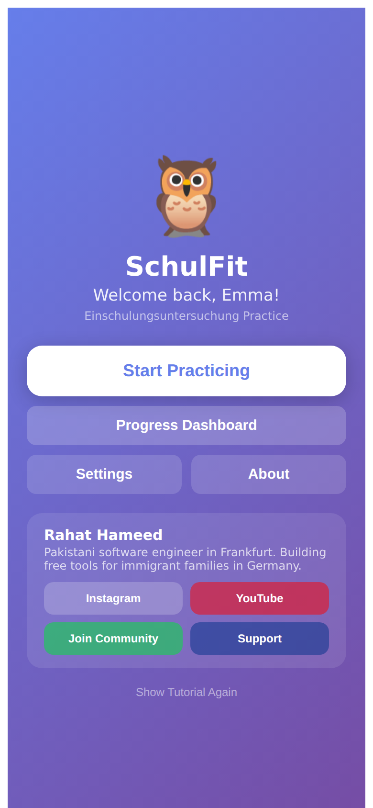
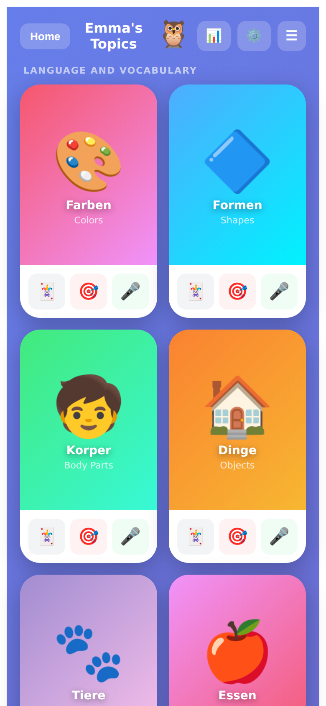
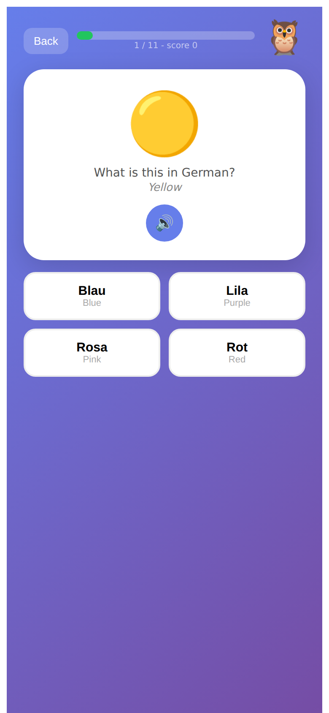
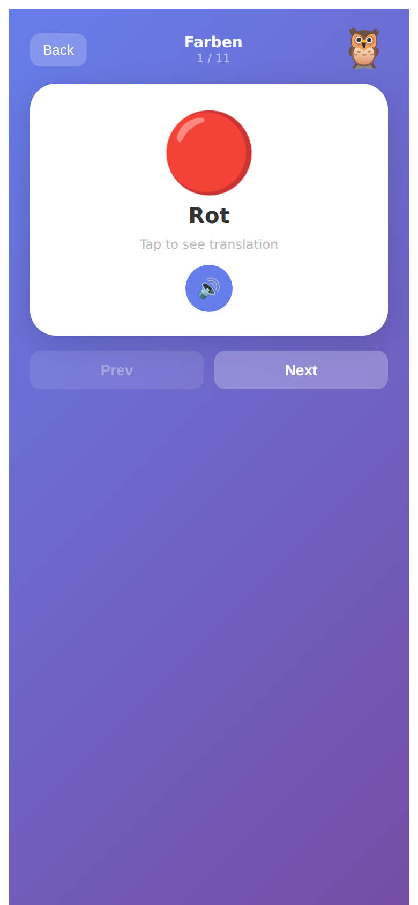
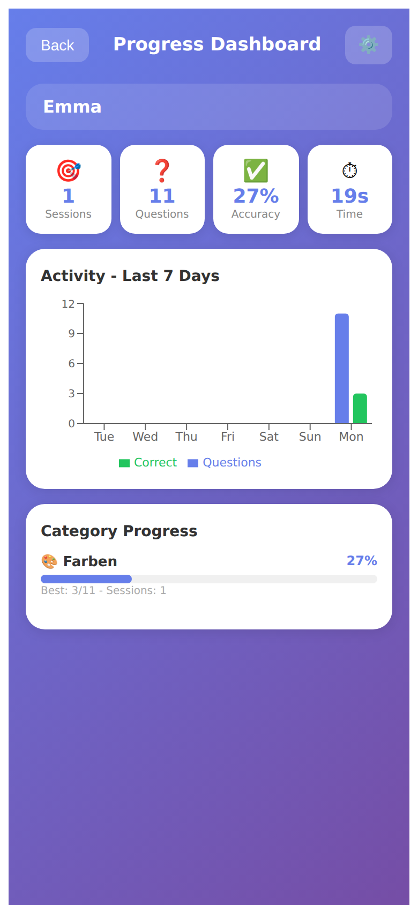
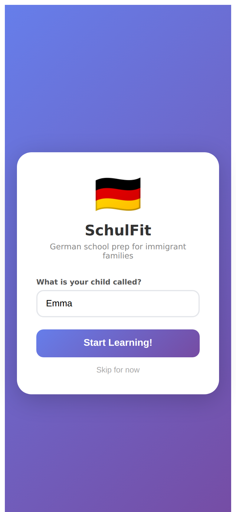
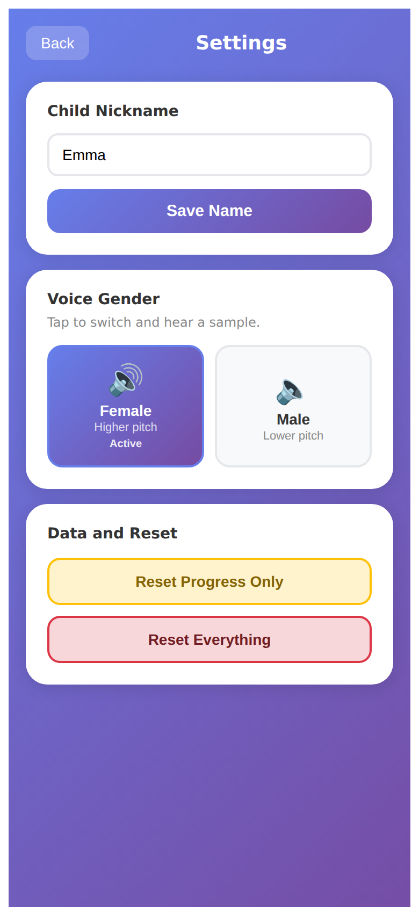
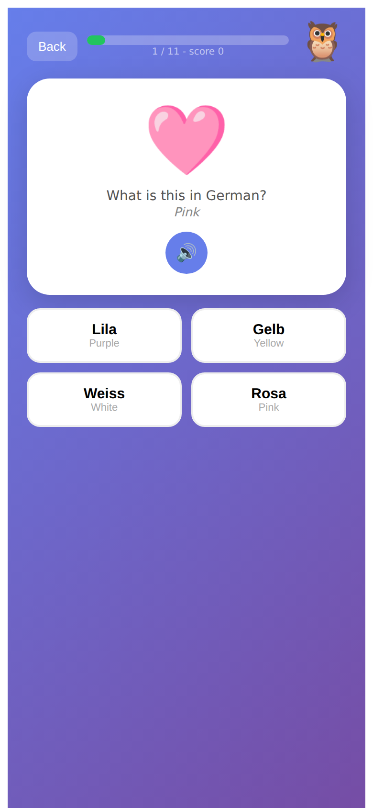
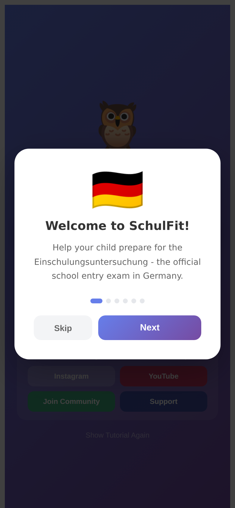

<p align="center">
  
</p>

<h1 align="center">SchulFit</h1>

<p align="center">
  <strong>German School Entry Exam Preparation for Immigrant Families</strong>
</p>

<p align="center">
  <a href="https://schulfit.vercel.app">Live Demo</a> •
  <a href="#features">Features</a> •
  <a href="#getting-started">Getting Started</a> •
  <a href="#contributing">Contributing</a>
</p>

<p align="center">
  
  
  
  
</p>

---

## About

**SchulFit** is a free, open-source web application designed to help immigrant families in Germany prepare their children for the **Einschulungsuntersuchung** (school entry examination). The app provides interactive learning activities covering vocabulary, numbers, colors, shapes, and more - all in German with English translations.

Built with love by a Pakistani software engineer in Frankfurt, this app addresses a real need in the immigrant community where parents often struggle to prepare their children for the mandatory school readiness assessment.

## Features

### Learning Categories
- **Colors & Shapes** - Learn German names for colors and geometric shapes
- **Body Parts** - Essential vocabulary for the medical examination
- **Animals & Objects** - Common nouns every child should know
- **Numbers 1-100** - Counting and number recognition in German
- **Math Basics** - Simple addition and subtraction
- **Even/Odd Numbers** - Number classification exercises
- **Singular/Plural** - German grammar fundamentals
- **Days & Seasons** - Time-related vocabulary
- **Family Members** - Essential family vocabulary
- **Positions** - Spatial awareness terms (oben, unten, links, rechts)

### Practice Modes
| Mode | Description |
|------|-------------|
| **Flash Cards** | Study by flipping cards to reveal translations |
| **Quiz Mode** | Multiple choice questions with instant feedback |
| **Voice Mode** | Speech recognition for pronunciation practice |

### Additional Features
- **Text-to-Speech** - Native German pronunciation for all words
- **Progress Tracking** - Saves learning progress locally
- **Statistics Dashboard** - Visual charts showing activity over time
- **Parent Guide** - Tips and checklist for the examination
- **Offline Support** - Works without internet (after first load)
- **Mobile Friendly** - Responsive design for all devices
- **No Account Required** - Start learning immediately

## Live Demo

**[https://schulfit.vercel.app](https://schulfit.vercel.app)**

## Screenshots

<p align="center">
  
  
  
</p>

<p align="center">
  
  
  
</p>

<details>
<summary><strong>View More Screenshots</strong></summary>
<br>

| Screen | Description |
|--------|-------------|
|  | Initial setup screen |
|  | Voice and profile settings |
|  | Quiz results with celebration |
|  | First-time user tutorial |

</details>

## Getting Started

### Prerequisites

- Node.js 18+ (or Docker)
- npm or yarn

### Quick Start with Docker (Recommended)

```bash
# Clone the repository
git clone https://github.com/RahatHameed/schulfit.git
cd schulfit

# Start development server with hot reload
make dev

# Or run production server
make prod
```

### Docker Commands

| Command | Description |
|---------|-------------|
| `make dev` | Start development server with hot reload (port 5173) |
| `make prod` | Build and run production server (port 80) |
| `make down` | Stop and remove containers |
| `make test` | Run test suite |
| `make logs` | View container logs |
| `make clean` | Remove all containers and images |
| `make help` | Show all available commands |

### Local Installation (Without Docker)

```bash
# Clone the repository
git clone https://github.com/RahatHameed/schulfit.git

# Navigate to project directory
cd schulfit

# Install dependencies
npm install

# Start development server
npm run dev
```

### Build for Production

```bash
npm run build
```

### Run Tests

```bash
npm run test:run
```

## Tech Stack

- **Frontend**: React 18.3
- **Build Tool**: Vite 5.4
- **Charts**: Recharts
- **Speech**: Web Speech API
- **Storage**: LocalStorage
- **Testing**: Vitest + React Testing Library
- **Containerization**: Docker + nginx
- **Hosting**: Vercel

## Project Structure

```
schulfit/
├── src/
│   ├── components/      # Reusable UI components (Owl, Confetti, etc.)
│   ├── screens/         # Screen components (Welcome, Menu, Quiz, etc.)
│   ├── hooks/           # Custom React hooks
│   ├── services/        # Business logic (Audio, Storage, Quiz)
│   ├── constants/       # App constants (modes, styles, celebrations)
│   ├── data/            # Static data (categories, colors, tutorial)
│   ├── utils/           # Utility functions (german, date, array)
│   ├── App.jsx          # Main application component
│   ├── App.test.jsx     # Test suite
│   └── main.jsx         # Entry point
├── Dockerfile           # Multi-stage Docker build
├── docker-compose.yml   # Dev/prod service definitions
├── Makefile             # Build commands
├── nginx.conf           # Production server config
├── package.json
├── vite.config.js
└── README.md
```

## What is Einschulungsuntersuchung?

The **Einschulungsuntersuchung** (School Entry Examination) is a mandatory health and developmental assessment in Germany that all children must pass before starting primary school (Grundschule). The examination typically includes:

- Vision and hearing tests
- Language and vocabulary assessment in German
- Number recognition and counting
- Fine motor skills (drawing)
- Gross motor skills (balance, hopping)
- Social and emotional readiness

This exam can be challenging for children from immigrant families who may have limited exposure to German before starting school. SchulFit helps bridge this gap.

## Contributing

Contributions are welcome! Whether it's:

- Reporting bugs
- Suggesting new features
- Adding new vocabulary categories
- Improving translations
- Enhancing UI/UX

Please feel free to open an issue or submit a pull request.

## Support the Project

If SchulFit has helped your family, consider supporting its development:

- **[PayPal](https://www.paypal.com/paypalme/rahatrajpoot)** - One-time donation
- **Star this repo** - Help others discover the app
- **Share** - Tell other immigrant families about SchulFit

## Connect

- **Instagram**: [@rahatrajpoot](https://www.instagram.com/rahatrajpoot)
- **YouTube**: [@rahatrajpoot](https://youtube.com/@rahatrajpoot)
- **Community**: [Join our Google Form](https://forms.gle/drTrdvgwEJsc9kbn7)

## License

This project is open source and available under the [MIT License](LICENSE).

## Author

**Rahat Hameed**
Pakistani Software Engineer based in Frankfurt, Germany
Building free tools for immigrant families

---

<p align="center">
  Made with ❤️ for immigrant families in Germany
</p>
